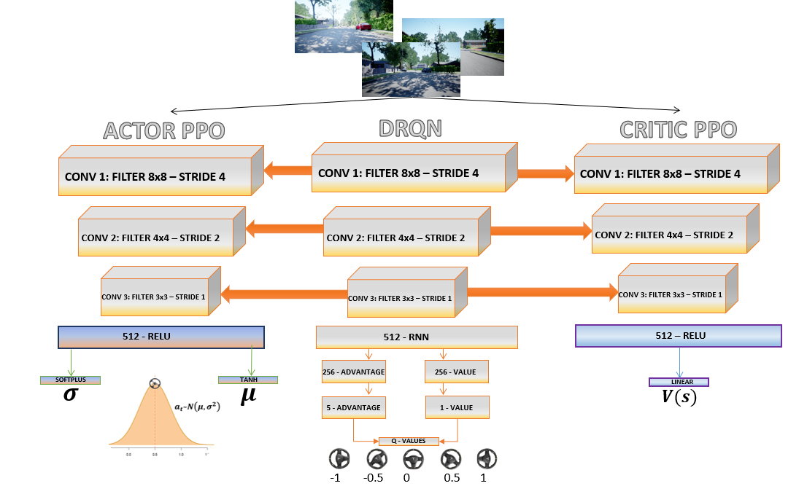

# PPO-based Autonomous Steering in AirSim Neighborhood with Transfer Learning

This project presents the implementation of a reinforcement learning algorithm for steering control of autonomous vehicles in a simulated environment, with the aim of optimizing navigation and driving in various scenarios. Specifically, Proximal Policy Optimization (PPO), one of the most advanced state-of-the-art methods for continuous control tasks, was employed.

During training, challenges related to learning stability and lack of performance improvements emerged, requiring modifications to both the neural network architecture and the training strategy. In particular, the classical convolutional neural network (CNN), similar to the one originally developed by Google DeepMind for DRL tasks, struggled to learn effectively due to low gradient magnitudes.

To overcome this issue, a feature extraction approach based on transfer learning was adopted. A pre-trained convolutional network, previously trained on a similar task using the Deep Recurrent Q-Network (DRQN) algorithm developed by V. Zangirolami et al., was leveraged to exploit prior knowledge and obtain more meaningful representations of input images. This strategy significantly improved driving performance during testing, confirming the effectiveness of the proposed methodology.

# Repository Structure  

The repository is organized as follows:  

- **PPO/**: Contains the code for the Proximal Policy Optimization (**PPO_FE**), the simulation environment management (including the reward calculation function in **AirSimEnv**), and a CSV file (**final_reward_points**) used for computing rewards.  
- **Weights/**: Store the trained model weights:  
  - **PPO-trained network weights** are saved in h5 format.  
  - **Pre-trained DRQN weights** are provided in their original TensorFlow format, including the corresponding index files.

# Methodology Scheme

# Demo
https://github.com/user-attachments/assets/be992d5c-8f7b-46e4-bc0a-4f8f62eb53ad

# References

- **Proximal Policy Optimization (PPO)**: Schulman et al., *Proximal Policy Optimization Algorithms*, 2017. 
- **Deep Recurrent Q-Network (DRQN)**: Zangirolami, V. and M. Borrotti, 2024. *Dealing with uncertainty: balancing exploration and exploitation in deep recurrent reinforcement learning*, *Knowledge-Based Systems*, 293.  
- **AirSim Simulator**: Microsoft's AirSim, an open-source simulator for autonomous vehicles. (https://github.com/microsoft/AirSim)  
- **DeepMind CNN Original Architecture**: Mnih et al., *Human-level control through deep reinforcement learning*, *Nature*, 2015.

# Acknowledgements
I would like to thank Prof. M. Borrotti and Dr. V. Zangirolami for their support throughout this project. I also appreciate the University of Milano-Bicocca for providing the virtual machine that made this experiment possible.
